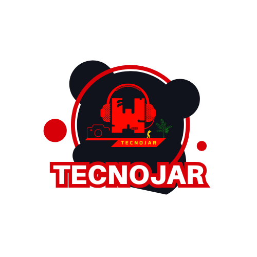

  

# 👋 Hola — Soy Wendell Jarquin

  <strong>Desarrollador web • Sistemas a medida • PHP · HTML · JavaScript</strong>

  
  
  
  
  

---

## Sobre mí
Soy Wendell Jarquin. Desarrollo sistemas y sitios web desde cero usando PHP puro, HTML y JavaScript (vanilla). Me enfoco en código claro, rendimiento, accesibilidad y en entregar soluciones listas para producción.

---

## Proyectos destacados
<table>
  <tr>
    <td align="center" valign="top" width="50%">
      

        <h3 style="margin:0 0 6px 0;">🎮 Games — Wendell Jarxd</h3>
        

          Colección de juegos y demos web con lógica propia en PHP y experiencias interactivas en JavaScript. Interfaz ligera y compatible con dispositivos móviles y de escritorio.
        

        
URL:

        <pre style="background:#f6f8fa; padding:8px; border-radius:6px; overflow:auto; margin-top:6px;">http://games.wendelljarxd.com/</pre>
      

    </td>

  </tr>
</table>

<table>
  <tr>
    <td align="center" valign="top" width="50%">
      

        <h3 style="margin:0 0 6px 0;">🏛️ Portal — Alcaldía Nueva Guinea</h3>
        

          Portal institucional desarrollado con PHP puro: administración de contenidos, accesibilidad y gestión enfocada en el equipo municipal.
        

        
URL:

        <pre style="background:#f6f8fa; padding:8px; border-radius:6px; overflow:auto; margin-top:6px;">https://alcaldianuevaguinea.com/</pre>
      

    </td>
  </tr>
</table>

---

## Visualización y estadísticas (2 columnas)
<table>
  <tr>
    <td align="center" valign="top" width="50%">
      
    </td>
    <td align="center" valign="top" width="50%">
      
    </td>
  </tr>

  <tr>
    <td align="center" valign="top" width="50%">
      
    </td>
    <td align="center" valign="top" width="50%">
      

        
      

      
Grupo: TECNOJAR — Desarrollo web integral: planificación, creación y soporte.

    </td>
  </tr>
</table>

---

## Qué ofrezco / Servicios
- Desarrollo de sistemas a medida (PHP puro)  
- Maquetado y experiencia de usuario con HTML y JavaScript  
- Integración con bases de datos MySQL y API REST sencillas  
- Auditoría de rendimiento, optimización y seguridad básica  
- Mantenimiento, backups y despliegue en servidores compartidos o VPS

---

## Temas de interés
- 🔧 Arquitectura ligera con PHP puro  
- 🧩 Buenas prácticas y código mantenible  
- ♿ Accesibilidad web (a11y)  
- 🚀 Rendimiento y optimización front-end  
- 🔒 Seguridad básica en sitios y formularios  
- 🔗 Integración de APIs y microservicios sencillos  
- 🎨 UX, maquetado responsivo y diseño centrado en el usuario

  
  
  
  
  

---

## Stack técnico
PHP (puro) • HTML5 • JavaScript (vanilla) • CSS moderno (responsive) • MySQL • Apache / Nginx

---

## Contacto
GitHub: Wendell-Jarquin

Proyectos (URLs en texto):
http://games.wendelljarxd.com/  
https://alcaldianuevaguinea.com/

---

¡Gracias por visitarme! 🙏  
Si te interesa colaborar o cotizar un proyecto, escríbeme y coordinamos los detalles.
